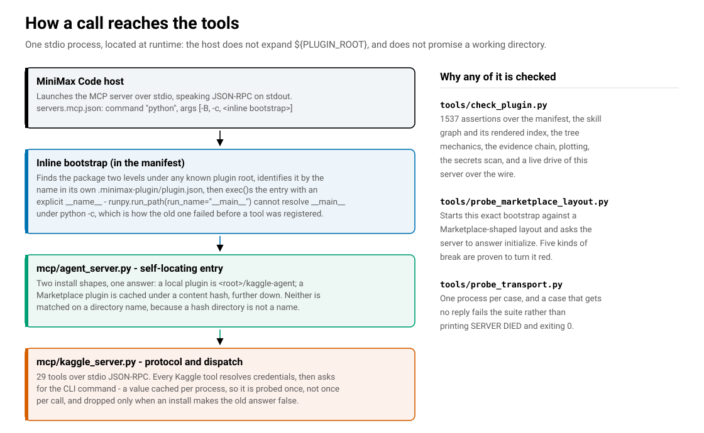
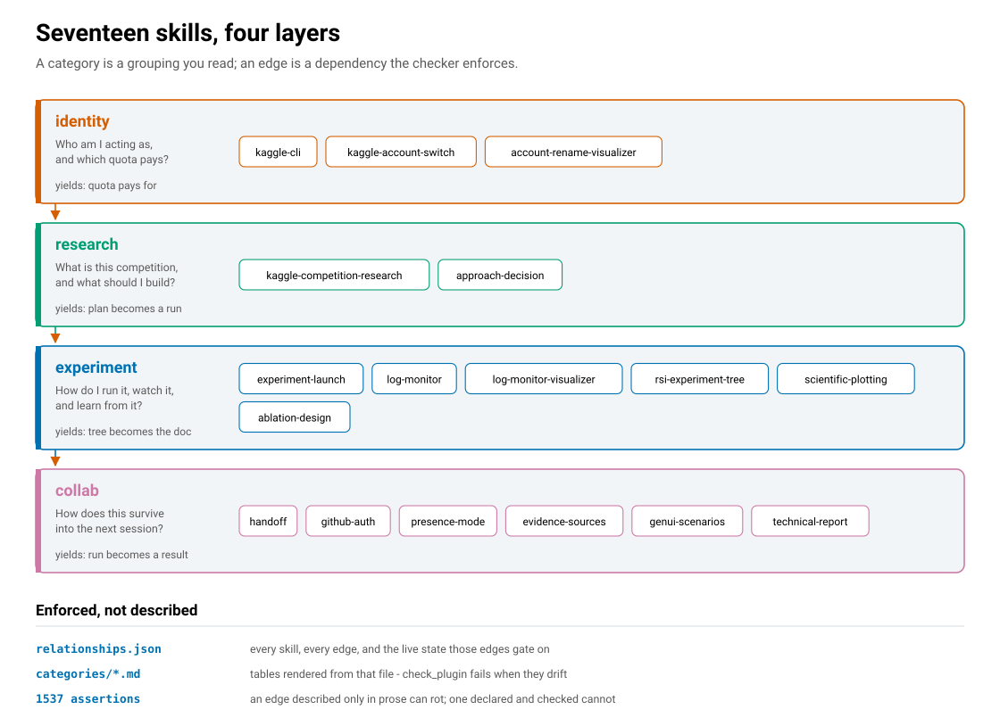
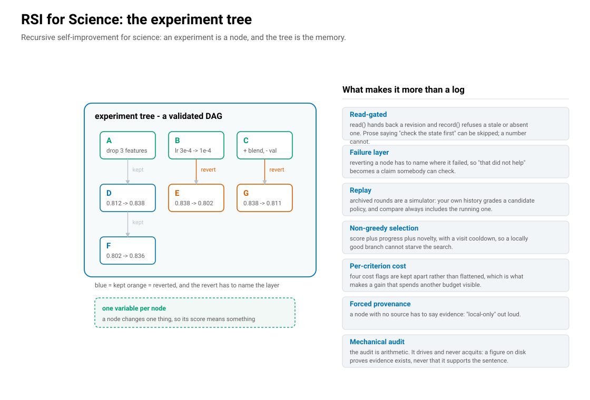

# Kaggle Agent

**The environment for human–agent competition research on Kaggle** — 人机协作在 Kaggle 取得竞赛研究成果的环境.

English · [中文](README.zh-CN.md)

**29 tools · 17 skills · 2 optional dependencies (plotting only).**

---

## What you get

| | |
|---|---|
| **Tools** | 29 — quotas, kernels, competitions, accounts, the RSI experiment tree, the evidence store, plotting, presence |
| **Skills** | 17 — grouped as identity, research, experiment, collab |
| **Subagents** | none — both halves of a research sweep run in the main thread |
| **Runtime dependencies** | none. The server is Python standard library only. `numpy` and `matplotlib` are needed for figures and nothing else, and the plotting skill checks before it draws and offers to install on your word. The Kaggle CLI itself is probed once at startup and, if absent, is offered through the same install path — never installed without you saying yes. |

---

## Architecture

### How a call reaches the tools



The host starts one stdio process and speaks JSON-RPC on its stdout. It does not expand
`${PLUGIN_ROOT}` and does not promise a working directory, so the manifest carries a one-line
bootstrap that locates the package at runtime — and two install shapes have to look the same
locally and in the Marketplace cache.

| | |
|---|---|
| `mcp/agent_server.py` | the self-locating entry. A local install is `<root>/kaggle-agent`; a Marketplace install is cached under a content hash, further down. Neither is matched on a directory name, because a hash directory is not a name. |
| `mcp/kaggle_server.py` | protocol and dispatch for 29 tools. Every Kaggle tool resolves credentials, then asks for the CLI command — a value cached per process, so it is probed once rather than once per call. |
| `mcp/credentials.py` | multi-account store. `token_for()` reads without writing, which is what makes a per-call `account=` safe. |
| `mcp/experiment_tree.py` | the RSI tree. |
| `mcp/deps.py` | what this machine can do, and the one route that may install something. |

The other ten modules cover evidence, handoff, GitHub sync, log monitoring, plots, presence, search
selection and structured input.

### The four categories



A category is a grouping you read; an edge is a dependency the checker enforces. The full graph
lives in [`skills/relationships.json`](skills/relationships.json) and is rendered into
[`skills/README.md`](skills/README.md).

| Category | The question it answers | Skills |
|---|---|---|
| **identity** | Who am I acting as, and which quota pays? | `kaggle-cli`, `kaggle-account-switch`, `account-rename-visualizer` |
| **research** | What is this competition, and what do I build? | `kaggle-competition-research`, `approach-decision` |
| **experiment** | How do I run it, watch it, and learn from it? | `experiment-launch`, `log-monitor`, `log-monitor-visualizer`, `rsi-experiment-tree`, `scientific-plotting`, `ablation-design` |
| **collab** | How does the work outlive this session, and when should I ask? | `handoff`, `github-auth`, `presence-mode`, `evidence-sources`, `genui-scenarios`, `technical-report` |

### Try asking

- *"Research the ARC Prize 2026 competition."*
- *"How much GPU quota do I have left?"*
- *"Should I write this myself or fork the top public notebook?"*
- *"Track my ablation experiments in a tree."*
- *"Watch this run's log and tell me when it errors."*
- *"Write a handoff so another agent can pick this up."*

---

## Install

**From the Marketplace** — search for *Kaggle Agent* in the plugin panel and install it. From the
CLI: `mcode plugin add kaggle-agent@official`.

**From a repository** — the plugin panel can also add a plugin straight from a GitHub repository;
point it at `https://github.com/Timothy-kira/kaggle-agent`.

Either route registers the package; neither builds it.

### Before the first call

| Requirement | Why |
|---|---|
| Python reachable **as `python`** | `servers.mcp.json` launches the server as `python`, so that exact name has to resolve. `python --version` is the check. |
| The Kaggle CLI | The tools shell out to it. If it is missing, `kaggle_sources action="doctor"` says so and offers to install it once you agree. |

**On macOS and Linux**, a machine that ships `python3` only has no `python`, and the symptom is a
plugin that installs cleanly and then exposes **no tools at all**. An empty tool list means the
interpreter was not found, not that the plugin failed to register. One line fixes it:

```bash
mkdir -p ~/.local/bin && ln -sf "$(command -v python3)" ~/.local/bin/python
```

Edit the installed manifest instead and the next update overwrites it. If the server still does not
come up, `python3 -B mcp/agent_server.py` starts it by hand and shows the error.

Both entry points under `bin/` are Python files with a shebang and no executable bit, invoked
through the interpreter — `python3 bin/kaggle-cli.sh`, `python3 bin/run-mcp.sh` — so one command
works on every platform and a packaged file mode never has to survive a checkout.

### Credentials

No token, key or account name is committed here, and the repository is scanned for them on every
validation run. Credentials resolve from your environment or from `~/.kaggle-agent/accounts.json`,
and a token you paste into the conversation is saved to your own store — never written into a
skill, a manifest, a log, a chart, or a handoff. A store at the previous location
(`~/.kaggle-cli/accounts.json`) is copied across on first read and left in place.

---

## RSI for Science



`kaggle_experiment_tree` is the core of the package: a read-gated, validated DAG **and** a replay
simulator. *RSI* here is recursive self-improvement for science — the loop is the point, and it only
becomes a loop if the memory survives the session.

- **The gate is real.** `action="read"` returns a revision; `record` refuses a stale or missing one.
  Prose that says "check the current state first" gets skipped. A revision number does not.
- **A node must declare its failure layer** when it is reverted, so "this didn't work" becomes a
  claim about *where* it broke.
- **Replay scores your own history** under a candidate exploration policy, and `compare` always
  includes the policy you are running — so a recommendation can never be worse than the status quo.
  A replay is an estimate, not a measurement; it says what to try, not what will win.
- **Parent selection is non-greedy** (`score + progress + novelty`, with visit cooling) so a locally
  promising branch cannot starve the search.
- **Per-criterion effective cost.** A gain on one criterion that quietly costs you two others is
  visible as such, because the four cost flags are kept per criterion rather than flattened into
  one boolean.
- **Provenance is mandatory.** A node needs a linked source or an explicit `evidence:"local-only"`.
  A claim with no evidence behind it has to say so out loud.
- **`action="audit-report"` checks the finished prose against the ledger.** It refuses mechanically
  when a `mayNotClaim` sentence has been copied in, or when the tree claims an artifact that is not
  on disk. It **drives and never acquits**: a figure the tree holds proves evidence exists, never
  that it supports the sentence.

---

## The tools

**Account and quota** — `kaggle_accounts` (add / switch / rename / list) · `kaggle_auth_status` ·
`kaggle_config_view` · `kaggle_quota` · `kaggle_accelerators`

**Kernels** — `kaggle_kernel_launch` (capped at 12h) · `kaggle_kernel_verify` · `kaggle_kernel_push` ·
`kaggle_kernels_list` · `kaggle_kernels_status` · `kaggle_kernels_logs` · `kaggle_kernels_output` ·
`kaggle_kernel_pull` · `kaggle_kernel_retire`

**Competitions** — `kaggle_competitions_list` · `kaggle_competitions_forums` ·
`kaggle_competitions_leaderboard`

**Science loop** — `kaggle_experiment_tree` · `kaggle_sources` · `kaggle_log_monitor`

**Collaboration and judgement** — `handoff_read` · `handoff_write` · `handoff_status` ·
`handoff_sync` · `github_auth` · `kaggle_presence` · `kaggle_search_engine`

---

## Validation

```bash
python tools/check_plugin.py
```

Around 1500 assertions covering the manifest, the skill graph and its rendered index, the tree
mechanics, the evidence chain, the plotting engine's backend, the secrets scan, and a live drive of
the MCP server over the wire. It is the reason the claims in the skills are claims rather than
intentions: a relationship described only in prose can rot, and one declared in the graph and
checked cannot.

Every file under a skill's `assets/`, `references/` or `scripts/` came from someone else, and all of
them are scanned for prompt-injection patterns on every run — with no allowlist, so a vendored file
added later is covered without anyone remembering. A clean scan is a floor rather than a verdict, and
the report says so rather than implying the content was cleared.

Seven probes drive the real thing rather than reading it: the transport, the ablation cycle, the
plot cycle, the claim audit, the monitor cycle, account scope, and the Marketplace layout — which
starts this package's own bootstrap against a Marketplace-shaped directory tree and asks the server
to answer `initialize`. Each probe is proved able to fail: five different breaks turn the layout
probe red, and the transport probe fails when a case gets no reply at all.

The checks include the failures this package actually had. `check_publishable` asserts that no
manifest path is excluded by `.gitignore`, that every gitignore directory rule is anchored, and
that no publishable file contains a credential — because a file once sat on disk, declared in the
manifest and linked from the graph, while the repository was short of it.

---

## Repository layout

```
.minimax-plugin/plugin.json   manifest: 17 skills, one MCP server, no apps
servers.mcp.json              stdio server, inlined bootstrap, cwd-independent
mcp/                          the server and its fifteen modules
skills/                       17 skills, flat as the manifest requires
  categories/                 the layering, as readable pages
  _shared/                    GenUI foundation, forked once
  relationships.json          the single source of truth for how skills connect
docs/                         the architecture figures, generated by tools/draw_architecture.py
tools/                        the enforcement layer
```

The figures are generated from code rather than drawn by hand, so the prose and the picture move
together and a check can require that they exist. `python tools/draw_architecture.py` redraws them.

---

## Attribution

`ablation-design` adapts the experimental-design and uncertainty-and-units material from the
MIT-licensed [K-Dense-AI/claude-scientific-skills](https://github.com/K-Dense-AI/claude-scientific-skills)
project. The method was taken; the dependency-heavy scripts were not. Original MIT licence and
upstream commit are recorded in the skill.

The replay and non-greedy-selection design follows *Dream-RSI* (arXiv 2609.14858), adapted from a
linear child chain to a multi-child DAG; the per-criterion cost accounting follows *Effective
Feedback Compute* (arXiv 2605.29682). Both are cited in the skills and in `mcp/experiment_tree.py`,
with the places where the adaptation is not a literal port called out in the comments.

## Licence

MIT.
